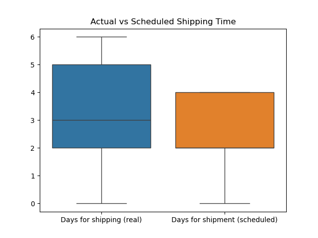
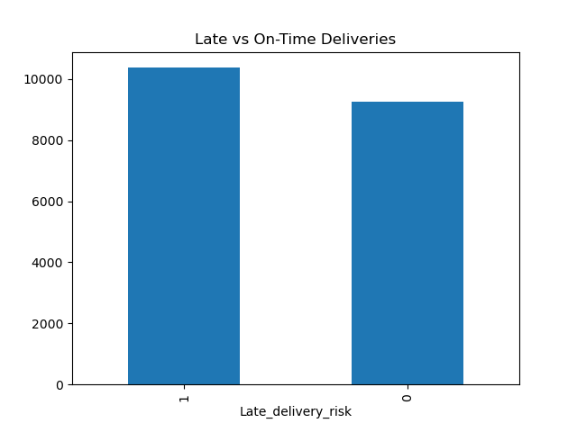
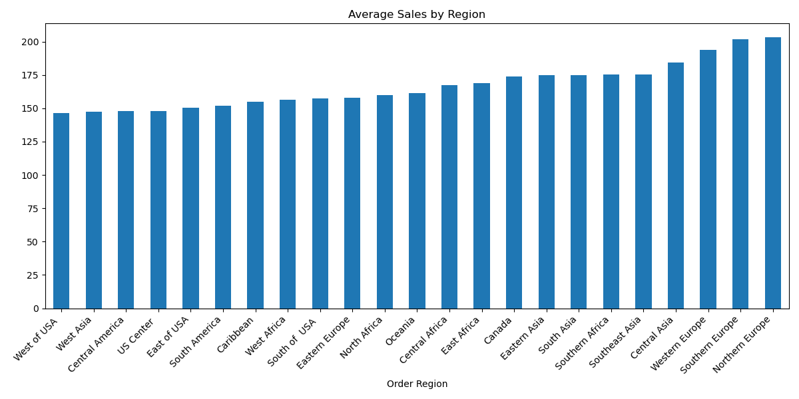
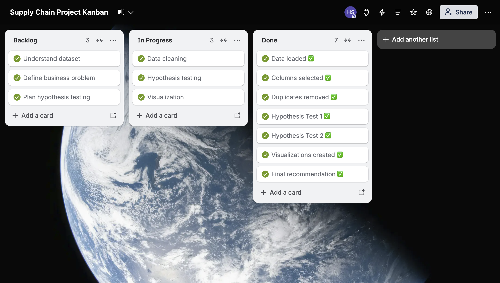

# 📦 Supply Chain Decision Analysis

## 📊 Project Overview
This project analyzes supply chain and logistics data from a global e-commerce dataset (DataCo), widely used in supply chain and analytics research.

📌 **Dataset Source:**  
Constante, Fabian; Silva, Fernando; Pereira, António (2019),  
*DataCo SMART SUPPLY CHAIN FOR BIG DATA ANALYSIS*, Mendeley Data, V5  
DOI: https://doi.org/10.17632/8gx2fvg2k6.5  

The dataset includes detailed information on orders, shipping performance, delivery status, and sales across multiple regions and product categories.

The data was selected to simulate real-world supply chain operations and evaluate how efficiently logistics processes are performing. The purpose of this project is to identify operational inefficiencies and support data-driven decision-making in supply chain management.

---

## 🎯 Objective
- Assess shipping performance  
- Identify supply chain inefficiencies  
- Apply statistical analysis  
- Provide data-driven recommendations  

---

## ⚙️ Data & Methodology
The analysis uses structured supply chain data (`DataCoSupplyChain.csv`) and includes:

- Data cleaning and preprocessing  
- Exploratory data analysis  
- Hypothesis testing  
- Data visualization  

### Key variables:
- Shipping time (actual vs scheduled)  
- Late delivery rate  
- Sales by region  

---

## 📊 Key Findings
- 🚚 **Shipping delays:** Actual shipping time is significantly greater than scheduled time  
- ⚠️ **High late delivery rate:** 52.87%, exceeding acceptable threshold (40%)  
- 🌍 **Regional variation:** Differences in performance across regions  

---

## 📊 Visualizations

### Shipping Comparison

### Late Delivery Distribution

### Sales by Region

---

## 📊 Executive Summary
Statistical analysis shows significant delays in shipping and a high late delivery rate of 52.87%, indicating supply chain inefficiencies.

These findings suggest that logistics operations need improvement before scaling. Reducing delays and optimizing delivery performance should be prioritized to enhance operational efficiency and customer satisfaction.

---

## ⚙️ Workflow (Kanban)

This project followed a structured Kanban workflow:
- Backlog: Understanding dataset and defining problem  
- In Progress: Data cleaning, analysis, visualization  
- Done: Insights and final recommendation  

---

- ## ☁️ Databricks Simulation
I structured this project as a data pipeline with stages including data ingestion, cleaning, statistical analysis, visualization, and reporting, similar to workflows in Databricks.

This approach was applied by loading supply chain data, preparing it, performing hypothesis testing, and presenting insights to support business decisions.

---

## 🧠 Tools Used
- Python (Pandas, SciPy)  
- Matplotlib & Seaborn  
- Jupyter Notebook  
- GitHub  
